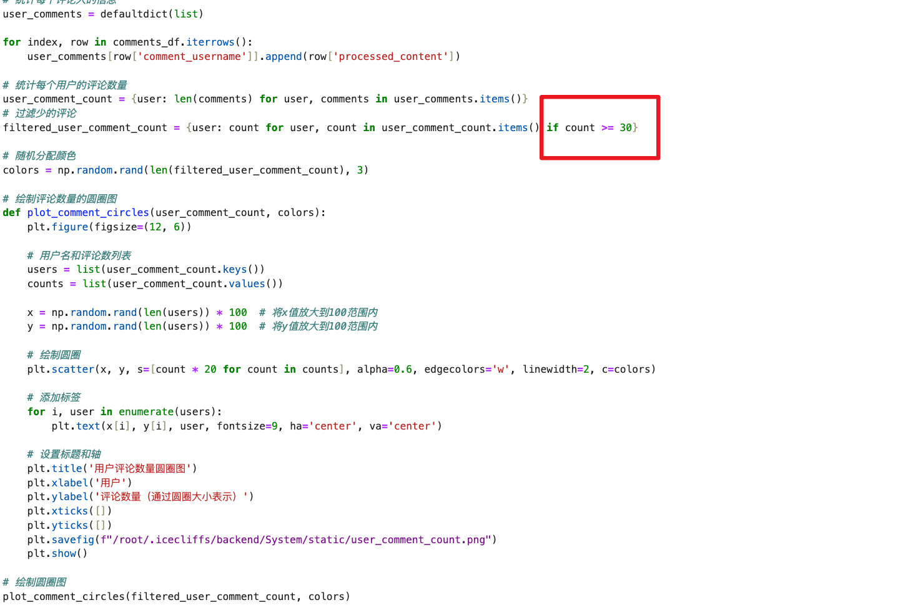
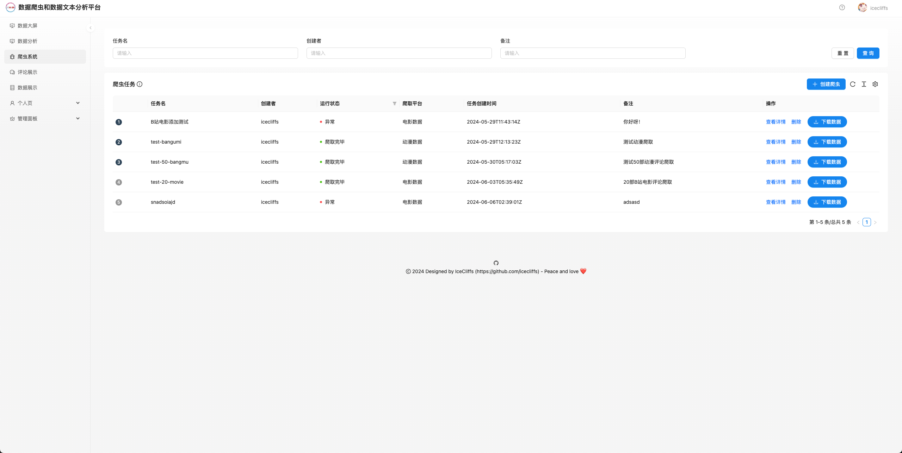
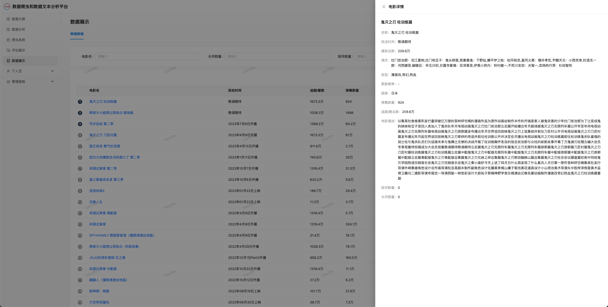

哔哩哔哩网站视频评论数据可视化及聚类分析

# 项目概述 

哔哩哔哩（Bilibili）是中国领先的视频分享网站之一，提供涵盖动画、音乐、游戏、科技、生活等多种内容的视频资源。近些年，随着用户数量的快速增长，哔哩哔哩的视频评论数据也呈现爆炸式增长。为此，我通过挖掘B站电影和动漫数据来做数据分析，通过KMeans、SnowNLP对这些动漫和电影评论进行数据及情感情感分析还有主题建模，从侧重点上反应了我国网民在该视频网站上的一些言论及其素质。

我的项目对上述数据做出了以下分析，主要有

1.  ­对电影及动漫评论分别作出词云分析

2.  对电影及动漫评论进行情感分析

3.  对电影及动漫评论进行KMeans聚类

4.  分析全站电影及动漫评论数据出现最多的词

5.  分析汇总全站电影及动漫评论数据所有词云

6.  分析全站电影及动漫评论数据长度分布

7.  统计全站电影及动漫最多评论的用户

## 软件开发环境：

（图2.1 PyCharm 2024.1.2 RC2软件截图）

### 

### 前后端开发工具均使用PyCharm 2024.1.2 RC2版本

（图2.2 Navicat Premium 16.3.7软件截图）

###  

### 数据库工具使用Navicat Premium 16.3.7版本

（图2.3 ApiFox Version 2.5.10 (2.5.10)截图）

###  软件API测试工具及项目规划工具使用ApiFox Version 2.5.10 (2.5.10)

##  第三方库包

### 数据分析及可视化处理

| scikit-learn | snownlp==0.12.3 | basemap | basemap-data | numpy |
|----|----|----|----|----|
| matplotlib | matplotlib-inline==0.1.7 | pandas==2.0.3 | jieba==0.42.1 | Jinja2==3.1.4 |

（表1 本项目所使用的数据分析及可视化处理Python Pip包）

### 爬虫模块

| requests==2.32.3 | beautifulsoup4==4.12.3 | Faker==25.3.0  |
|------------------|------------------------|----------------|
| httpx==0.27.0    | lxml==5.2.2            | Scrapy==2.11.2 |

（表2 本项目所使用的爬虫模块Python Pip包）

### 后端框架

| Django==4.2.13                       | django-redis==5.4.0 | pyOpenSSL==24.1.0 |
|--------------------------------------|---------------------|-------------------|
| djangorestframework==3.15.1          | PyJWT==2.8.0        | pyotp==2.9.0      |
| djangorestframework-simplejwt==5.3.1 | PyMySQL==1.1.1      | redis==5.0.4      |

（表3 本项目所使用的后端框架Python Pip包）

# 数据采集

##  数据需求

为了更好的进行数据分析，我实现调研了B站视频数据，发现B站目前侧重于发展短视频用户，这也导致部分用户言论过于抽象而且有不少弹幕广告水军混杂在评论里边，爬出来的数据如果做分析的话会造成不良影响，为此排除掉短视频评论。

（图3.1 现阶段B站主页视频推荐，无时政内容）

（图3.2 某短视频部分言论）

综合豆瓣网站电影影评信息，发现B站也有自己的影评系统，为此我分别对电影和动漫两大系统展开了评论分析，发现大多数评论都是非常友好而且具有客观的事实及逻辑思维，可以很好的帮我们分析出一部电影/动漫的好坏程度，为后续的数据分析做了更好的准备。而且B站有风纪委员（评论审判）系统，这个系统裁判重心也是放在B站动漫和电影评论这块，故对这俩大核心板块作出爬虫数据分析处理。

（图3.3 电影《建党伟业》页面介绍图）

（图3.4 电影《建党伟业》评论图）

##  数据爬取

首先对需要的单一页面进行分析，方便后面批量处理，下面这张图标出了需要进行分析的数据。

（图3.5 电影《建国大业》页面）

通过右击审查元素，我们可以使用Chrome浏览器自带的Dev工具来定位页面标签元素，方便后续我们使用XQuery语法进行查询，如下图，如果我们需要爬取电影简介，则通过XPath语法定位到该标签即可。

（图3.6 电影《建国大业》页面HTML源码，WebPack打包后）

（图3.7 电影《让子弹飞》页面真正HTML源码，WebPack打包前）

但是，在实际爬取中B站使用了WebPack技术，通过打包前端部分内容，让页面访问速度变快的方法，导致我们直接解析网页是不可取的，为此，通过requests.text方法，我们可以把原数据还原出来，然后构建新的XQuery语句去查询页面标签。

（图3.8 电影《让子弹飞》页面爬虫代码）

其他数据处理也是如此，不过爬虫我使用的是Scrapy框架进行爬取，效率更加高效、快速，这里对Scrapy框架做一个说明。

（图3.9 Scrapy框架项目结构图）

文件说明：

- AnimeCommentSpider.py – 动漫评论数据爬虫模块

- AnimeInfoSpider.py – 动漫综合信息爬虫模块

- MovieCommentSpider.py – 电影评论数据爬虫模块

- MovieInfoSpider.py – 电影信息爬虫模块

- items.py - Scrapy参数体说明

- pipelines.py – 控制Scrapy输出结果

下面是爬虫流程图

（图3.10 项目总体爬虫流程图）

具体流程说明

1.  用户提交爬虫申请，系统判断是电影爬虫还是动漫爬虫

2.  如果是上述其中一种爬虫，则系统先对B站进行ID爬取，并将ID值暂存到Redis里

3.  Scrapy收到爬虫响应，从Redis获取ID值，并开始信息爬虫

4.  信息爬虫成功后，则对应的进行评论内容爬虫

5.  评论爬虫成功后，对所有信息和评论存储到数据库里**（注：所有过程都是实时的）**

具体代码如下

（图3.11 电影代码）

（图3.12 解析代码）

（图3.13 部分Scrapy框架字段代码）

（图3.13 Redis数据暂存）

（图3.14 MySQL部分数据）

# 数据准备

## 数据清洗

本次一共爬取了**872158（捌拾柒万贰仟壹佰伍拾捌元整）**条数据，总字数**13233560（壹仟叁佰贰拾叁万叁仟伍佰陆拾元整）**字。

首先给出需要清洗的对象，在爬取过程中，B站会对未上映的电影/动漫的状态（对应数据库movie_update_info字段）设置为“敬请期待”，同时长评论数量（movie_long_review_count）和短评论数量（movie_short_review_count）会变为NULL这样可能会造成一定的精度损失，为此，对这些数据做标记，如果出现上述情况，则不对这些数据进行分析，并且将movie_long_review_count和movie_short_review_count字段设置为0，避免pandas数据处理时爆出错误。

（图4.1 数据丢失1）

（图4.2 数据丢失2）

（图4.3 电影/动漫详情数据字段）

其次就是评论数据，关于评论数据，这里主要对一些标点符号和颜文字（诸如：ฺ(◣д◢)ฺ、╮(￣⊿￣)╭…）进行清洗，并且排除单个标点符号评论和一些杂乱的数据，清洗后的评论数据根据电影/动漫ID字段（comment_anime_id）和数据表里的电影/动漫（movie_id）做关联，并合并数据，具体代码如下。

（图4.4 数据总量）

（图4.5 杂乱数据）

合并完后的数据如下图所示，可以更好的方便我们做数据分析处理

（图4.6 清洗及合并代码）

（图4.7 合并后的数据）

# 数据分析处理与训练模型的构建

## 数据处理

> 部分步骤同上述4.1步骤

（图5.1 代码）

## 数据分析

### 对每部动漫和电影做词云分析

这里jieba分词词典来自搜狗和百度自然语言处理实验室，停顿词来自哈工大，接着对每一条评论进行分词处理，去除停顿词等信息。

（图5.2 分词代码）

然后将每一部动漫和电影进行分词处理，效果如下

（图5.3 某部动漫词云分析）

最后生成一张所有电影或动漫的总词云

（图5.4 所有动漫词云汇总）

（图5.5 所有电影词云汇总）

### 对每部动漫和电影做情感分析

这一步主要用SnowNLP来通过情感分析技术评估每部动漫和电影的评论情绪，从而得出观众对每部作品的整体情感倾向。情感分析有助于理解观众对作品的喜好和评价，衡量出一部动漫/电影的好坏。

（图5.6 情感分析代码）

首先，我从评论数据和电影数据的CSV文件中读取相关信息，并通过评论中的 comment_anime_id 和电影数据中的 movie_id 进行合并，得到包含电影名称和评论内容的完整数据集。然后我们使用了 SnowNLP 库中的情感分析工具对每条评论进行情感分析，SnowNLP 会对每条评论内容进行打分，分数范围在0到1之间，分数越接近1表示情感越积极（好），越接近0表示情感越消极（烂），生成的图表如下：

（图5.7 电影ID20310848情感分析结果）

### 对所有动漫和电影分别统计评论中前20个出现最多的词

（图5.8 代码详情）

（图5.9 所有电影中出现最多的词）

### 对所有动漫和电影分别统计评论长度分布

（图5.10 主要代码）

（图5.11 所有电影评论长度分布）

（图5.12 所有动漫评论长度分布）

### 统计所有作品中评论数最多的用户

这一步，通过统计数据库里的评论数最多的用户，绘制圆圈图，显示用户的评论数量，通过圆圈的大小表示评论数的多少，由于数据量较大，如果统计评论10条评论内的用户会有几十万条，做出来的图像不美观，所以评论数量限制在了30条以内。

（图5.13 核心代码）

（图5.14 用户评论数量圆圈图）

### 对每部作品进行KMeans聚类分析

这里对每部数据进行分割之后，接着对每一部作品的名称关联内容，即根据comment_anime_id和movie_id将评论数据和作品数据合并，合并完成后，删除多余的movie_id列，以确保数据的完整性，接着通过jieba分析加载中文分词词典和哈工大停用词表，确保后续能识别出非常有意义的词语，同时去除无意义的停用词。

（图5.15 数据整理）

然后分别对每一部作品进行聚类分析，遍历每部动漫作品的评论数据，并对每部动漫进行单独的聚类分析，使用 TfidfVectorizer 将处理后的评论文本转换为TF-IDF特征向量，表示每个词在文本中的重要性。接着使用 KMeans 算法对TF-IDF特征向量进行聚类，将相似的评论分为同一簇。聚类数设置为3，或评论数量少于3时取评论数，同时取出每隔簇的前10个词将数据保存在CSV里，接着用PCA将数据将降维到2D以绘制散点图。

（图5.16 聚类代码）

生成的部分数据展现如下

（图5.16.1 聚类标签）

生成的图表如下

（5.17 KMeans图例，坏的一面）

（5.18 KMeans图例，好的一面）

### 使用SnowNLP对评论进行情感分析统计出最好看的前15部电影和动漫

根据每部作品的情感分析来汇总成一个大的表格，但是这里还是重新做了一下情感分析，原理类似5.2.2，只不过这次生成的是所有的，可以让我们直观看出哪些作品是好是坏

（5.19 主要代码）

（图5.20 前15部最好看的电影）

（图5.21 前15部最好看的动漫）

# 数据可视化

应实验要求，本次项目均采用Matplotlib来绘制图像，所有图像在上面分析过程中已经呈现过了，这里对前后端做一个说明。

前端使用的是Ant Design主题框架，该框架界面美观，高端大气，其次用到了不少第三方库作为数据渲染的来源

后端使用的是Django框架，API编写风格遵循Restful API，可以高效、直观的看清楚一些业务需求。

（6.1 后端项目结构）

（6.2 后端运行状态）

（6. 前端项目结构）

# 结果总结

在本项目中，我通过对哔哩哔哩电影和动漫的数据挖掘进行深入的分析，总结一下所做的工作，首先就是我采用了前后端分离的形式来编写本套系统，前端使用的是React、AntDesign框架，后端使用的是Django，数据库是MySQL和Redis缓存，爬虫框架为Scrapy，通过这一系列操作下来，可以得到一个美观且高效的可视化爬虫系统，大大减少使用命令行的操作，直观的显示方便我们进行后续的处理。

其次就是对这些爬下来的数据做分析，主要有以下几个分析，1.词云分析、2.情感分析、3.Kmeans聚类分析、4.全站评论词频统计、5.评论长度分布统计、6.评论最多的用户统计、7.最佳评论电影和动漫。

通过这些几十万条的数据，我觉得B站的二次元数量还是比较多的，大多数都喜欢看动漫并发表自己的观点，相反，电影会少一点，这也可能是因为B站近几年才开通电影区，总而言之，我们可以通过这些数据来分析每一部作品的好坏程度，后续如果有时间，我会跟进完善一个推荐算法，根据每一个用户的评论和作品来管理该用户喜欢什么样的作品，并对其推荐这些作品。

# 项目界面截图

（图8.1 首页登录页面）

（图8.2 二次登录页面）

（图8.3 数据分析大屏1）

（图8.4 数据分析大屏2）

（图8.5 数据分析页面）

（图8.6 爬虫系统页面）

（图8.7 新建爬虫页面）

（图8.8 爬虫页面标签选取）

（图8.9 评论展示页面）

（图8.10 评论展示抽屉页面）

（图8.11 数据展示页面）

（图8.12 数据详情页面抽屉）

（图8.13 数据分析页面1）

（图8.14 数据分析页面2）

（图8.15 查看评论页面）

（图8.16 个人中心页面）

（图8.17 用户管理页面）

（图8.18 新建用户页面）

（图8.19 用户详情页面）

（图8.20 系统日志页面）
